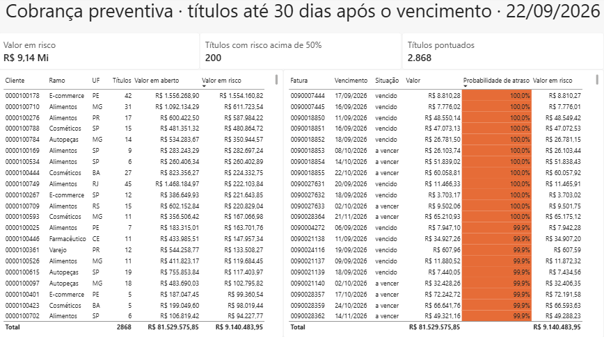
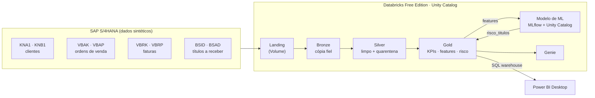
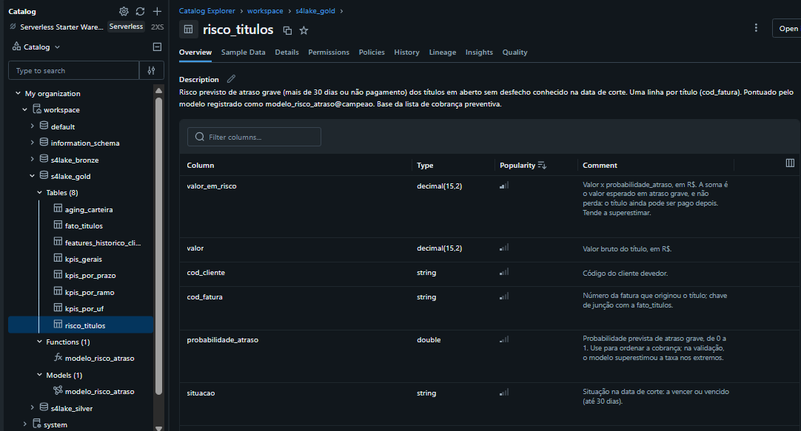
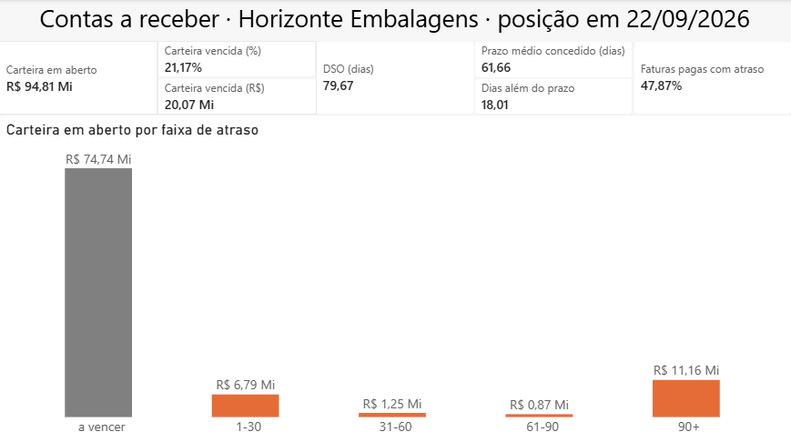
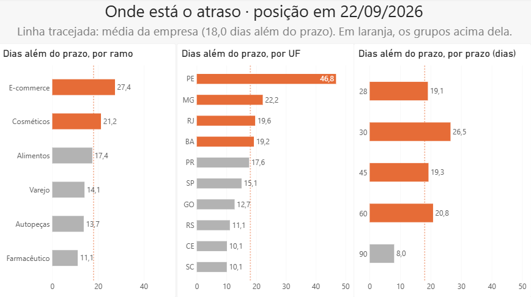
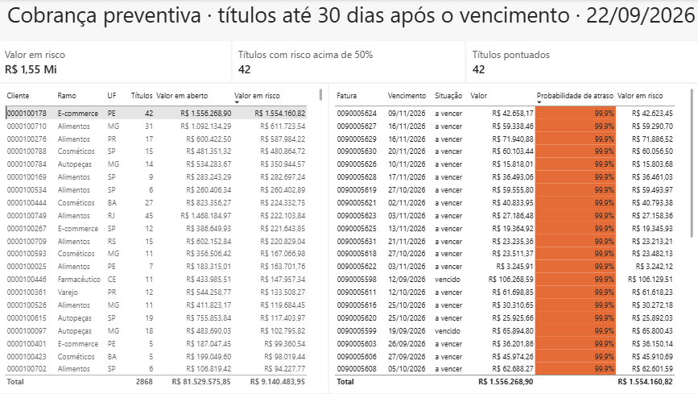
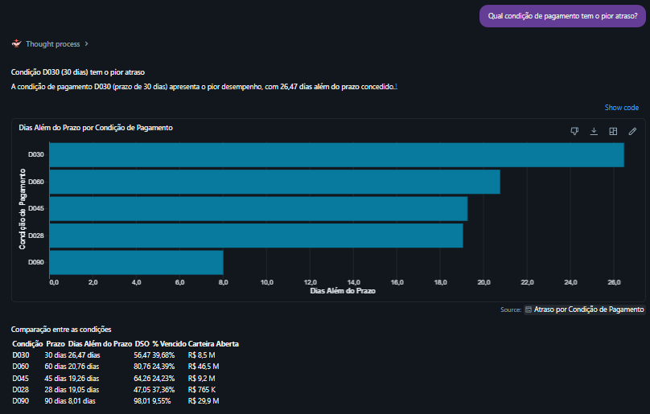
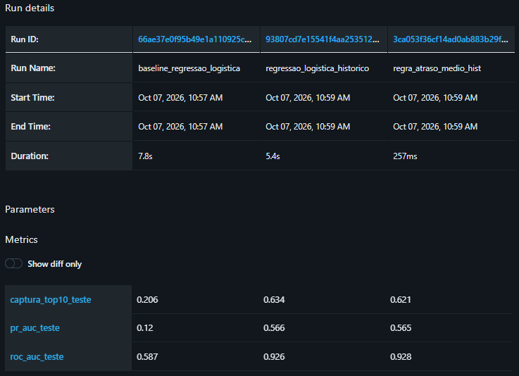
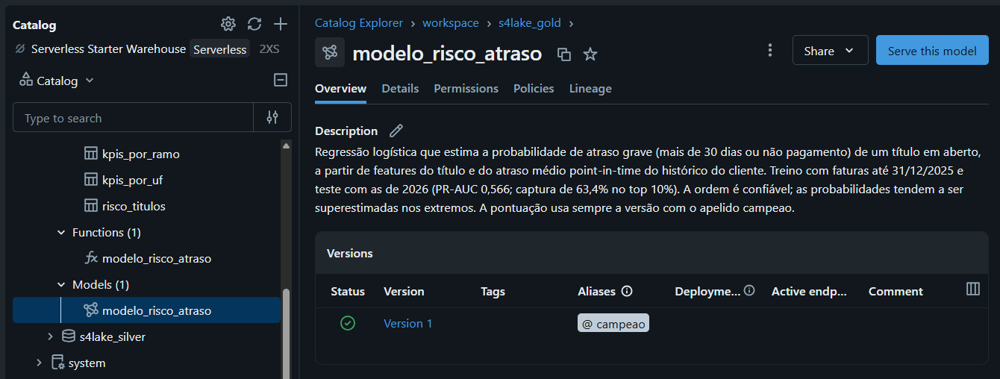

# S4Lake — Order-to-Cash

Arquitetura de referência **SAP + Databricks** para análise e previsão de recebíveis, inspirada no
[SAP Business Data Cloud](https://www.sap.com/products/data-cloud/databricks.html).

**Em resumo:** a partir de dados no modelo SAP (SD + FI-AR), o projeto monta um pipeline Bronze → Silver → Gold
no Databricks, mede onde está o atraso de recebimento e prevê quais faturas em aberto vão atrasar.

- **DSO 18 dias acima do prazo concedido**, com o atraso concentrado em um ramo, uma UF e poucos clientes.
- **O modelo encontra 63% dos atrasos graves** ligando para só 10% dos títulos, contra 10% ao acaso.
- **R$ 9,14 mi em risco** na carteira em aberto, com **5 clientes concentrando 39%** desse valor.
- **Nenhuma linha some:** toda tabela da Silver reconcilia com a origem (válidos + quarentena = origem).


*Obs.: Em clientes críticos, a probabilidade chega a valores acima de 99,9%, exibidos como 100,0% no painel, efeito da mesma causa.*

> **Transparência:** o SAP Databricks é um produto corporativo licenciado dentro do SAP Business Data Cloud (BDC).
> A SAP oferece um [basic trial do BDC](https://www.sap.com/products/data-cloud/trial.html) de 30 dias, em tenant
> compartilhado com dados pré-configurados e sem persistência entre períodos, o que não permite hospedar um
> pipeline próprio. Por isso, este projeto reproduz o mesmo padrão de arquitetura com o **Databricks Free Edition**
> (SAP HANA Cloud previsto), usando dados sintéticos que seguem o modelo de dados real do SAP (SD + FI-AR).

---

## 1. O problema de negócio

A **Horizonte Embalagens S.A.** (empresa fictícia) é uma indústria B2B que vende embalagens para
clientes de alimentos, varejo, e-commerce, cosméticos, farmacêutico e autopeças em dez estados do Brasil.

A empresa fatura bem, mas o **caixa não acompanha o faturamento**. Quase metade das faturas é paga com
atraso, e a área de Crédito e Cobrança trabalha de forma reativa: só descobre o problema depois que a
fatura vence. O time de cobrança é pequeno e não consegue ligar para todos os clientes.

> **Pergunta central:** quanto tempo leva, e o que faz demorar, para um título sair da **BSID** (em aberto)
> e chegar na **BSAD** (pago)?

## 2. Perguntas que o projeto responde

| Área | Pergunta | Decisão apoiada | Onde é respondida |
|---|---|---|---|
| Diretoria financeira | Quanto tempo levamos, em média, para transformar venda em caixa (DSO)? | Planejamento de capital de giro | `kpis_gerais` · Power BI, página 1 |
| Diretoria financeira | O DSO está piorando? | Planejamento de capital de giro | *Previsto: série mensal do DSO* |
| Crédito e Cobrança | Quais faturas **ainda não vencidas** têm maior risco de atraso? | Priorizar a cobrança preventiva | Modelo de ML · `risco_titulos` · Power BI, página 3 |
| Crédito e Cobrança | Quais clientes mudaram de comportamento recentemente? | Revisar limite e condição de pagamento | *Previsto: monitoramento do risco ao longo do tempo* |
| Comercial | Algum ramo, região ou condição de pagamento concentra o atraso? | Política comercial e de prazos | Recortes da Gold · Power BI, página 2 |

## 3. Indicadores (KPIs)

- **DSO** (Days Sales Outstanding): prazo médio de recebimento, comparado ao prazo médio concedido
- **Dias além do prazo**: DSO menos o prazo médio concedido; permite comparar grupos com prazos diferentes
- **Aging da carteira**: a vencer, vencido 1–30, 31–60, 61–90 e 90+ dias, em quantidade e em R$
- **% de faturas pagas com atraso** e **atraso médio** (simples e ponderado pelo valor)
- **Valor em risco (R$)**: valor esperado em atraso grave nos títulos em aberto, calculado como valor × probabilidade
  de atraso grave prevista pelo modelo. Atraso grave não é perda: um título pode atrasar mais de 30 dias e ainda ser pago.

### Resultados na data de corte (22/09/2026)

Todos os atrasos de títulos em aberto são medidos contra uma **data de corte fixa**, o mesmo conceito da
data-chave (*key date*) dos relatórios de contas a receber do SAP, como a FBL5N. Assim, o resultado é
reproduzível: rodar o pipeline em outro dia não muda os números.

| Indicador | Valor |
|---|---:|
| Carteira em aberto | R$ 94.812.358,05 |
| Carteira vencida | R$ 20.072.845,68 (21,17%) |
| Faturas pagas com atraso | 47,87% (12.147 de 25.373) |
| Atraso médio simples / ponderado pelo valor | 5,54 / 5,69 dias |
| DSO (janela de 90 dias) | 79,67 dias |
| Prazo médio concedido (ponderado pelo valor) | 61,66 dias |
| Dias além do prazo (DSO − prazo médio concedido) | 18,01 dias |
| Valor em risco (títulos em aberto até 30 dias após o vencimento) | R$ 9.140.483,95 |

**Principais leituras:**

- **Faturas maiores atrasam mais:** o atraso ponderado pelo valor é maior que o simples.
- **O aging tem forma de "U":** a maior parte dos vencidos está em 1–30 dias ou já passou de 90 dias
  (402 de 728 títulos vencidos, R$ 11,16 mi). A janela de cobrança efetiva é o primeiro mês.
- **Um único KPI não basta:** o atraso médio dos pagos fica abaixo de 6 dias, mas o DSO está 18 dias acima
  do prazo concedido. O atraso médio só enxerga quem pagou (viés de sobrevivência); o DSO enxerga a
  carteira, onde ficam os títulos que nunca foram pagos.

> **Duas medidas parecidas, mas diferentes:** os **dias além do prazo** (18,01) comparam o DSO com o prazo
> médio concedido e são usados nos recortes e no painel. A definição de livro do *Average Days Delinquent*
> é o DSO menos o *Best Possible DSO* (calculado só com a carteira a vencer), o que equivale à
> **carteira vencida medida em dias de venda: 16,87 dias**. Os dois números não devem ser misturados.

### Onde está o atraso: recortes por ramo, UF e prazo

O DSO bruto **engana** na comparação entre grupos, porque cada grupo tem uma mistura diferente de prazos.
Por isso, os recortes são comparados pelos **dias além do prazo**:

- **Prazo:** o D090 tem o maior DSO (98 dias), mas é o grupo que menos atrasa (8 dias além do prazo,
  contra 19 a 26 nos demais). Quem recebe 90 dias naturalmente demora mais para pagar, mesmo pagando em dia.
- **Ramo:** e-commerce é o pior (27,35 dias além do prazo) e farmacêutico, o melhor (11,09). Pelo DSO
  bruto, o farmacêutico parecia mediano.
- **UF:** Pernambuco se destaca com 46,80 dias além do prazo, mais que o dobro do segundo colocado. O Ceará,
  que parecia ruim pelo DSO bruto (80,70), é um dos melhores estados (10,13).
- **Concentração:** em Pernambuco, um único cliente responde por **81% da carteira vencida do estado**.
  Ele continua comprando e pagando, mas paga **100% das faturas com atraso** e deixou cerca de 1 em cada 4
  títulos sem pagamento. É um mau pagador habitual, e não um caso de títulos em disputa: a validação do modelo
  com o gabarito confirmou que ele pertence ao perfil crítico. A ação indicada é tratá-lo individualmente
  (limite e condição de pagamento), e não mudar a política comercial do estado.
- **Grupos pequenos pedem cautela:** cada recorte traz a quantidade de clientes, porque segmentos com poucos
  clientes (CE com 29, BA com 39) variam ao acaso.

## 4. Arquitetura



- **Landing**: volume do Unity Catalog onde os arquivos chegam sem transformação
- **Bronze**: cópia fiel da origem (tudo como texto, datas `YYYYMMDD`, chaves com zeros à esquerda) com metadados de auditoria
- **Silver**: tipagem, deduplicação, nomes de negócio, integridade referencial, **quarentena** de registros inválidos e **reconciliação** de contagens
- **Gold**: fato de títulos, KPIs gerais, recortes por ramo, UF e prazo, aging em R$, features do modelo e risco previsto (detalhes abaixo)
- **ML**: classificação do risco de atraso por título com scikit-learn, experimentos no MLflow e modelo registrado no Unity Catalog; a pontuação volta para a Gold
- **Consumo**: painel no Power BI Desktop lendo a Gold por um SQL warehouse, e espaço Genie para perguntas em português

Tudo fica no catálogo `workspace`, nos schemas `s4lake_bronze`, `s4lake_silver` e `s4lake_gold`.

### Tabelas da Gold

| Tabela | Grão (uma linha é...) | Linhas |
|---|---|---:|
| `fato_titulos` | um título a receber, com dias de atraso, situação e faixa de aging | 28.725 |
| `kpis_gerais` | a empresa inteira em uma data de corte | 1 |
| `kpis_por_ramo` | um ramo de atividade | 6 |
| `kpis_por_uf` | uma UF | 10 |
| `kpis_por_prazo` | um prazo de pagamento | 5 |
| `aging_carteira` | uma faixa de aging da carteira em aberto | 5 |
| `features_historico_cliente` | um título, com o histórico do cliente conhecido na emissão dele | 28.725 |
| `risco_titulos` | um título em aberto sem desfecho conhecido, com a probabilidade de atraso e o valor em risco | 2.868 |

O modelo campeão fica registrado no mesmo schema, como `workspace.s4lake_gold.modelo_risco_atraso`.

Os recortes são calculados pela mesma função que gera a `kpis_gerais`: chamada sem agrupamento, ela
reproduz exatamente os 12 indicadores gerais, o que serve de teste para os recortes.

Todas as tabelas e colunas da Gold têm descrições (*comments*) no Unity Catalog, com grão, unidade, fórmula
e forma de interpretação. Elas são aplicadas pelos próprios notebooks a cada execução, ficam versionadas no Git
e são a principal fonte de contexto do Genie.



### O processo Order-to-Cash nas tabelas SAP

O cliente é cadastrado (**KNA1/KNB1**), faz um pedido (**VBAK/VBAP**), recebe a fatura (**VBRK/VBRP**),
e essa fatura vira um título em aberto (**BSID**) até ser paga (**BSAD**).

## 5. Painel no Power BI e espaço Genie

A pasta `dashboards/` contém o painel em Power BI Desktop, em **modo Import**: os dados (sintéticos)
vão dentro do `.pbix`, então qualquer pessoa consegue abri-lo no Power BI Desktop, sem acesso ao Databricks.
As credenciais de conexão não ficam salvas no arquivo.

| Página | Para quem | O que mostra |
|---|---|---|
| Visão executiva | Diretoria financeira | Carteira em aberto e vencida, DSO com o prazo concedido e os dias além do prazo, % pago com atraso e aging em R$ |
| Onde está o atraso | Área Comercial | Dias além do prazo por ramo, UF e prazo, com a média da empresa como referência e destaque para os grupos acima dela |
| Cobrança preventiva | Crédito e Cobrança | Valor em risco, títulos com risco acima de 50%, clientes ordenados pelo valor em risco e, ao clicar num cliente, os títulos dele com a probabilidade prevista |

**Visão executiva**



**Onde está o atraso**



**Cobrança preventiva**, com o cliente 0000100178 selecionado: os 42 títulos em aberto dele aparecem com
probabilidade acima de 99%, o que mostra a superestimação nas pontas descrita na seção 6.



Todas as regras de negócio ficam na Gold; o Power BI apenas exibe. O painel foi feito no Power BI Desktop;
a publicação no Power BI Service ficaria para um ambiente corporativo.

### Espaço Genie

O espaço Genie responde perguntas em português sobre as sete tabelas da Gold, usando o SQL warehouse.
Ele foi testado em duas rodadas com perguntas de resposta conhecida (DSO, pior condição de pagamento,
cliente com mais valor vencido, valor em risco total, títulos de alto risco e maiores clientes em risco):

- **Só com as descrições das colunas**, os números já vieram certos em todas as perguntas, inclusive na
  pergunta-armadilha sobre prazos, em que o DSO bruto apontaria a condição errada.
- **A interpretação precisou de instruções**: sem elas, o Genie inventava tendências, afirmava causas a partir de
  associações e rotulava clientes sem verificar o histórico. Cada erro virou uma instrução geral,
  sem números fixos, para continuar válida em outras datas de corte.
- **Deslizes de narrativa persistem** em parte das respostas. Por isso, o Power BI é a fonte oficial dos números,
  e o Genie é usado para exploração, com conferência.



O Genie aponta a D030 pelos dias além do prazo, e não a D090, que tem o maior DSO bruto: quem recebe 90 dias
naturalmente demora mais para pagar, mesmo pagando em dia.

A configuração, as sete instruções e as perguntas de teste com as respostas esperadas estão em
[`dashboards/genie_espaco.md`](dashboards/genie_espaco.md).

## 6. Modelo de risco de atraso

**Objetivo:** ordenar os títulos em aberto por risco, para a Crédito e Cobrança priorizar as ligações antes
que o atraso fique grave.

### Alvo e base de treino

**Alvo:** um título é positivo se for pago com **mais de 30 dias** de atraso ou continuar em aberto depois disso.
O corte de 30 dias vem do aging em "U": quem passa do primeiro mês quase não paga mais.

**Base de treino sem desfecho inventado:** só entram títulos que venceram há mais de 30 dias na data de corte,
independentemente do status. Filtrar pelo status deixaria na base recente só os bons pagadores (viés de sobrevivência).
Dos 28.725 títulos, 24.681 entram no treino. Dos 4.044 restantes, 2.868 continuam em aberto e são pontuados
pelo modelo; os outros 1.176 já foram pagos e não precisam de cobrança.

**Separação temporal:** treino com faturas emitidas até 31/12/2025 e teste com as de 2026, simulando um modelo
treinado no fim de 2025 e usado durante 2026.

| Conjunto | Títulos | Positivos | Taxa |
|---|---:|---:|---:|
| Treino | 18.012 | 1.144 | 6,35% |
| Teste | 6.669 | 494 | 7,41% |

### Features

- **Do título**, conhecidas na emissão: valor (padronizado), prazo, mês do vencimento, ramo e UF (categorias).
- **Do histórico do cliente, calculadas *point-in-time***: para cada fatura, o atraso médio dos outros títulos
  do mesmo cliente que **já se conheciam na data de emissão dela**. Títulos pagos antes da emissão entram com o
  atraso final; títulos vencidos e ainda em aberto na emissão entram com o atraso contado até a emissão.
  Nenhum dado posterior à emissão é usado, o que evita vazamento.
- **Sem histórico**: 3.573 títulos da base (quase todos dos primeiros meses de dados) não têm nenhum título
  anterior pago ou vencido. Eles recebem a mediana do treino, aprendida dentro do pipeline, e uma flag `sem_historico`.

Conferência da feature: na última fatura do cliente com mais valor vencido, ela conta 249 títulos de histórico,
exatamente os 170 pagos mais os 79 vencidos que a `fato_titulos` mostra para ele na data de corte.

### Comparação: baseline, regra simples e modelo

Um modelo só se justifica se superar a melhor regra simples de negócio. Por isso, três abordagens foram
avaliadas no mesmo teste de 2026 e registradas no MLflow:

| Abordagem (teste) | PR-AUC | Captura no top 10% | ROC-AUC |
|---|---:|---:|---:|
| Acaso | 0,074 | 10% | 0,500 |
| Baseline: regressão logística só com features do título | 0,120 | 20,6% | 0,587 |
| Regra simples: ordenar pelo atraso médio histórico do cliente | 0,565 | 62,1% | 0,928 |
| **Modelo: regressão logística com o histórico do cliente** | **0,566** | **63,4%** | 0,926 |



**Leituras:**

- **O histórico do cliente é o que importa.** Ligando para os 10% de títulos de maior risco, a cobrança
  alcançaria cerca de 313 dos 494 atrasos graves de 2026, contra 102 do baseline e 49 ao acaso.
- **O modelo empata com a regra simples na ordenação.** Ele foi mantido por outro motivo: entrega uma
  **probabilidade**, e não só uma ordem, que é o que permite calcular o valor em risco em reais.
  Sem `class_weight`, a probabilidade média prevista no treino (6,36%) coincide com a taxa real (6,35%).

### Validação com o gabarito

O gerador guarda o perfil oculto de pagamento de cada cliente, que **nunca** entrou como feature.
Comparando o risco previsto com esse perfil, no teste:

| Perfil oculto | Títulos | Probabilidade média prevista | Taxa real de atraso grave |
|---|---:|---:|---:|
| Pontual | 3.693 | 2,1% | 0,1% |
| Tolerável | 1.972 | 4,6% | 3,8% |
| Atrasador | 753 | 29,6% | 29,2% |
| Crítico | 251 | 90,6% | 78,5% |

O risco previsto sobe na ordem certa e acompanha a taxa real: o modelo redescobriu o perfil de cada cliente
sem nunca tê-lo visto. O cliente que concentra o vencido de Pernambuco aparece como **crítico** no gabarito.

**Limitação conhecida:** nas pontas, o modelo exagera (pontual e crítico acima da taxa real). No teste, ele
previu cerca de 619 atrasos graves, contra 494 reais, cerca de 25% a mais. A causa provável é a parte do
histórico medida até a emissão: em clientes com títulos parados há muito tempo, ela cresce com o tempo e
ultrapassa os valores vistos no treino. **A ordem da lista é confiável; o valor em risco deve ser lido como um teto.**

### Pontuação e resultados

O modelo campeão está registrado no Unity Catalog como `modelo_risco_atraso`, com o apelido `campeao`. A
pontuação carrega sempre o modelo com esse apelido, então trocar de modelo não exige mudar código.



Na data de corte, foram pontuados os **2.868 títulos em aberto** que ainda não completaram 30 dias após o
vencimento (R$ 81,53 mi, igual à carteira a vencer mais a faixa 1–30 do aging):

- **Valor em risco: R$ 9,14 mi**, cerca de 11% do valor pontuado.
- **200 títulos** têm probabilidade acima de 50% (R$ 6,29 mi) e concentram **57%** do valor em risco.
- **Cinco clientes** concentram **39%** do valor em risco; só o maior deles responde por 17%.
- O risco é muito concentrado: metade dos títulos tem probabilidade abaixo de 2,1%.

Para a cobrança, isso significa que uma lista curta resolve a maior parte do problema.

## 7. Stack

Python (pandas, numpy, scikit-learn) · Databricks Free Edition · PySpark · Spark SQL · Delta Lake · Unity Catalog ·
Databricks SQL warehouse · Genie · MLflow (experimentos e registro de modelos no Unity Catalog) · Power BI Desktop ·
Git + GitHub (Databricks Git folders) · *previstos:* SAP HANA Cloud, GitHub Actions + Databricks Asset Bundles

## 8. Qualidade de dados e reconciliação

O gerador injeta problemas de qualidade **de propósito**, para que a camada Silver precise tratá-los:

| Tabela | Problema injetado | Tratamento na Silver |
|---|---|---|
| KNA1 | 8 clientes duplicados | Deduplicação determinística por window function |
| KNA1 | 16 clientes sem CNPJ | Sinalizados com a flag `cnpj_ausente` (mantidos) |
| VBAP | 449 itens com quantidade zerada | Quarentena |
| VBRP | 259 itens com ordem de origem inexistente | Quarentena por integridade referencial |

**Regra do projeto: nenhuma linha some.** Válidos + quarentena = origem, em todas as tabelas:

| Origem (Bronze) | Linhas | Silver (válidos) | Quarentena | Situação |
|---|---:|---:|---:|---|
| KNA1 + KNB1 | 808 / 800 | 800 clientes | – | 8 duplicatas removidas |
| VBAK | 29.877 | 29.877 | – | ✅ |
| VBAP | 89.869 | 89.420 | 449 | ✅ |
| VBRK | 28.725 | 28.725 | – | ✅ |
| VBRP | 86.446 | 86.187 | 259 | ✅ |
| BSID + BSAD | 3.352 + 25.373 | 28.725 | 0 | ✅ |

Checagem de consistência de negócio: **BSID + BSAD = VBRK** (toda fatura virou exatamente um título a receber).

Na Gold, as tabelas também se amarram:

- a soma dos títulos por situação reproduz as contagens da Silver (pagos no prazo + pagos com atraso = 25.373;
  a vencer + vencidos = 3.352);
- os valores somados na `fato_titulos` batem com a carteira aberta e o total pago da `kpis_gerais`;
- em cada recorte, as colunas de soma e contagem reproduzem a `kpis_gerais` (razões não são somadas entre grupos);
- a junção dos títulos com os clientes mantém as 28.725 linhas, sem nenhum título sem ramo ou UF;
- 790 dos 800 clientes têm títulos; os 10 restantes estão cadastrados, mas nunca foram faturados;
- a `features_historico_cliente` tem uma linha por título (28.725) e os nulos da feature na base do modelo
  (3.573) são exatamente os títulos sem histórico do treino (3.248) e do teste (325);
- o valor pontuado na `risco_titulos` (R$ 81.529.575,85) é igual à carteira a vencer mais a faixa 1–30 do aging.

## 9. Principais decisões de arquitetura

| Decisão | Por quê |
|---|---|
| Bronze com tudo como texto e sem correções | Preserva zeros à esquerda e a fidelidade à origem; se uma regra estiver errada, dá para reprocessar sem voltar ao SAP |
| Renomear as colunas na Silver | Da Silver em diante, o consumidor é o analista, não o especialista SAP; o nome original fica preservado na Bronze |
| Flag quando o registro é usável; quarentena quando não é | Cliente sem CNPJ continua devendo; item com quantidade zero não faz sentido |
| `decimal(15,2)` para valores monetários | Evita os erros de arredondamento do `double`; mesmo padrão do SAP |
| Integridade referencial contra a Silver e left joins | Reaproveita dado já tratado e impede que registros sumam em silêncio |
| Não recalcular o cabeçalho da ordem de venda | Mantém o valor oficial do SAP; os KPIs financeiros nascem da fatura |
| Data de corte fixa, e não `current_date()` | Reprodutibilidade; espelha a data-chave dos relatórios de contas a receber do SAP |
| Dias de atraso com sinal na fato; negativos zerados só no KPI | A fato fica intacta e cada indicador decide como usar o dado |
| Classificações sem valor padrão (`otherwise`) | Um caso inesperado aparece como nulo, em vez de ganhar um valor inventado |
| Gold com detalhe e resumos em tabelas separadas | Grãos diferentes para perguntas diferentes; o painel lê dos resumos |
| Colunas de soma e contagem mantidas nas tabelas de KPIs | Qualquer leitor consegue refazer cada indicador |
| DSO com carteira e faturamento na mesma base (valor bruto) | Dividir valor bruto por líquido inflaria o DSO |
| Recorte por prazo usa o prazo do título, e não o do cadastro | O prazo do cadastro é o atual; aplicado ao histórico, inverteria causa e efeito quando o prazo muda |
| Uma função de KPIs para o total e para os recortes | Evita código copiado; sem agrupamento, reproduz a `kpis_gerais` e serve de teste |
| Divisões com `try_divide` | No modo ANSI, uma divisão por zero quebraria o pipeline |
| Dias além do prazo e quantidade de clientes em cada recorte | O DSO bruto não é comparável entre grupos; grupos pequenos pedem cautela |
| Descrição do ramo na dimensão de clientes (Silver) | É atributo do cliente; Gold, Power BI e Genie herdam o nome legível |
| Regras de negócio na Gold, e não no Power BI | Cada regra existe em um só lugar; o painel apenas exibe |
| Power BI em modo Import | Economiza a cota da Free Edition e permite versionar o `.pbix` com os dados |
| Descrições das tabelas aplicadas pelos notebooks | Regravar uma tabela apaga comentários feitos à mão; como código, ficam versionados e são reaplicados |
| Genie com instruções gerais, sem números fixos | Os números mudam a cada data de corte; as regras de interpretação, não |
| Alvo com corte de 30 dias e títulos não pagos incluídos | O corte segue o aging; ignorar os não pagos esconderia os casos mais graves |
| Base de treino definida pelo vencimento, nunca pelo status | Filtrar pelo status cria viés de sobrevivência nos períodos recentes |
| Separação temporal entre treino e teste | Um sorteio deixaria o modelo aprender com o futuro |
| Prazo e mês como categorias | A relação com o atraso não é linear (dezembro e janeiro, D030 pior que D028) |
| Regressão logística sem pesos de classe | Os pesos quase não mudam a ordem da lista e distorceriam as probabilidades usadas no valor em risco |
| PR-AUC como métrica principal e captura no top 10% para o negócio | A acurácia não serve com 6,6% de positivos; a captura traduz o modelo em ligações |
| Features de histórico calculadas *point-in-time*, com a condição de data dentro do join | Cada fatura só enxerga o que se sabia na emissão; a condição no join mantém os títulos sem histórico |
| Títulos abertos no histórico entram com o atraso até a emissão | Ignorá-los descreveria como bom pagador um cliente que está devendo agora |
| Features em tabela própria na Gold | O treino e a pontuação leem a mesma regra, sem cópias que possam divergir |
| Nulos tratados com a mediana do treino dentro do pipeline, mais uma flag | Sem vazamento do teste e sem esconder do modelo que o título não tinha histórico |
| Comparar o modelo com uma regra simples | Um modelo só se justifica se superar a melhor alternativa sem modelo |
| Manter o modelo mesmo empatando com a regra na ordenação | Só o modelo entrega uma probabilidade calibrada, necessária para o valor em risco |
| Gabarito usado só na validação | Usá-lo como feature seria vazamento; como validação, mostra se o modelo aprendeu o padrão certo |
| Modelo registrado no Unity Catalog com o apelido `campeao` | A pontuação não depende do número da versão; trocar de modelo é mover o apelido |
| Pontuar só os títulos em aberto sem desfecho | Títulos já pagos não precisam de cobrança; os vencidos há mais de 30 dias já são atraso grave |

## 10. Estrutura do repositório

```
data_generator/   Gerador de dados sintéticos no modelo SAP
pipelines/        Notebooks Bronze → Silver → Gold
ml/               Modelo de previsão de atraso
dashboards/       Painel do Power BI (.pbix) e configuração do espaço Genie
docs/             Dicionário de dados e decisões de arquitetura
```

Notebooks do pipeline:

| Notebook | O que faz |
|---|---|
| `01_bronze_ingestao` | Lê os CSVs do volume e grava as 8 tabelas Bronze com metadados de auditoria |
| `02_silver_clientes` | Deduplica a KNA1, junta com a KNB1, sinaliza CNPJ ausente e acrescenta a descrição do ramo |
| `03_silver_vendas` | Separa ordens e itens, tipa valores e envia itens inválidos para a quarentena |
| `04_silver_faturamento` | Faturas e itens com duas checagens de integridade referencial |
| `05_silver_contas_receber` | Unifica BSID e BSAD em títulos a receber, calcula o vencimento e valida contra as faturas |
| `06_gold_fato_titulos` | Calcula dias de atraso contra a data de corte, situação e faixa de aging de cada título |
| `07_gold_kpis_gerais` | Resume a carteira em uma linha de KPIs: vencidos, atrasos médios, DSO, prazo médio e dias além do prazo |
| `08_gold_recortes` | Junta os títulos aos clientes e calcula os KPIs por ramo, UF e prazo, e o aging em R$ |

Notebooks de ML (pasta `ml/`):

| Notebook | O que faz |
|---|---|
| `09_ml_base_treino` | Define o alvo, monta a base, separa treino e teste no tempo, compara baseline, regra simples e modelo com histórico no MLflow, valida com o gabarito e registra o modelo campeão |
| `10_ml_features_historico` | Calcula o atraso médio *point-in-time* do histórico de cada cliente e grava a `features_historico_cliente` |
| `11_ml_pontuacao` | Carrega o modelo campeão, pontua os títulos em aberto sem desfecho e grava a `risco_titulos` |

## 11. Como reproduzir

### 1. Gerar os dados

```bash
pip install -r requirements.txt
python data_generator/generate_sap_o2c.py --saida data/raw
```

Opções: `--clientes`, `--inicio`, `--corte`, `--seed`, `--formato csv|parquet` e `--limpo`
(desativa os problemas de qualidade injetados de propósito).

Ao ler os CSVs, trate todas as colunas-chave como **texto**, senão os zeros à esquerda somem
(ex.: `pd.read_csv(..., dtype=str)` ou `inferSchema=false` no Spark).

A pasta `data/_gabarito/` contém o perfil real de pagamento de cada cliente. Ela serve **somente para
validar** o modelo e nunca é usada como variável de entrada (evita *data leakage*).

### 2. Rodar no Databricks

1. Clone este repositório como **Git folder** no workspace do Databricks (Free Edition).
2. Suba os CSVs de `data/raw` para o volume da Landing, no caminho indicado no início do notebook `01_bronze_ingestao`.
3. Rode os notebooks do pipeline na ordem, de `01` a `08`.
4. Rode os notebooks de ML na ordem `10` → `09` → `11`: as features de histórico precisam existir antes do treino,
   e a pontuação usa o modelo registrado pelo treino.
5. Para o painel, abra o `.pbix` da pasta `dashboards/` no Power BI Desktop. Para atualizar os dados, conecte-o
   ao seu SQL warehouse (com um token de acesso pessoal).

### Simplificações conscientes

- A condição de pagamento (prazo em dias) é extraída do próprio código (`D030` → 30); num SAP real, viria da tabela **T052**.
- A descrição do ramo de atividade é mapeada no notebook; num SAP real, viria da tabela de textos **T016T**.

## 12. Roadmap

- [x] Definição do problema de negócio
- [x] Gerador de dados SAP (SD + FI-AR)
- [x] Ingestão Bronze no Databricks
- [x] Camada Silver com regras de qualidade e reconciliação
- [x] Camada Gold e KPIs
  - [x] Fato de títulos com atraso, situação e aging
  - [x] KPIs gerais com DSO e dias além do prazo
  - [x] Aging em R$ e recortes por ramo, UF e condição de pagamento
  - [ ] Série mensal do DSO, para acompanhar a tendência
- [x] Painel e espaço Genie
  - [x] Power BI: visão executiva
  - [x] Power BI: onde está o atraso
  - [x] Power BI: cobrança preventiva, com o risco previsto
  - [x] Espaço Genie no Databricks, com a tabela de risco
- [x] Modelo de risco de atraso (MLflow)
  - [x] Alvo, base de treino e separação temporal
  - [x] Baseline com regressão logística
  - [x] Features de histórico do cliente (*point-in-time*)
  - [x] Comparação com uma regra simples e validação com o gabarito
  - [x] Registro do modelo no Unity Catalog e pontuação dos títulos em aberto na Gold
- [ ] Melhorias do modelo: corrigir a superestimação nas pontas e monitorar mudanças de comportamento dos clientes
- [ ] Exploração do SAP Databricks no basic trial do SAP Business Data Cloud
- [ ] Carga no SAP HANA Cloud
- [ ] CI/CD com GitHub Actions + Databricks Asset Bundles
- [ ] Artigo (SpecificData e LinkedIn)

---

Autor: **Cauã Souza Almeida**